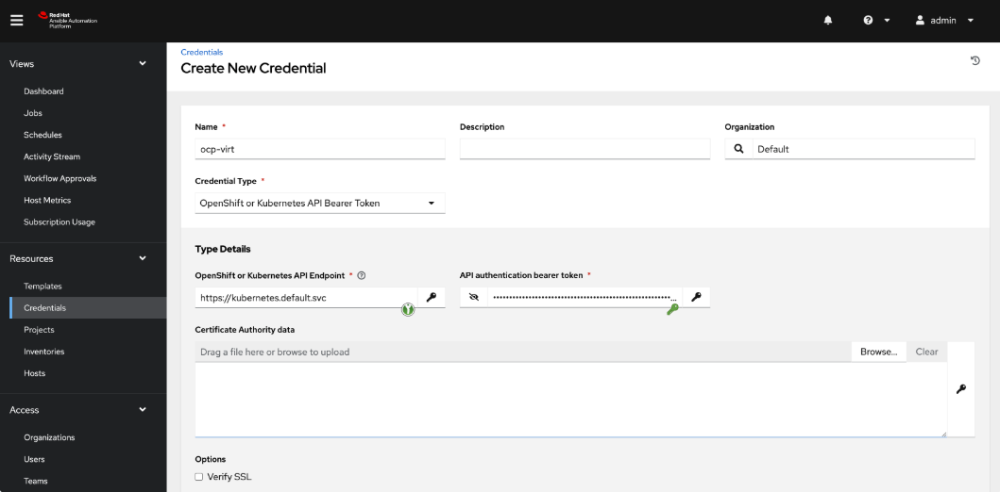

# ansible_ocp-virt
This repo contains some stuff around ansible and OpenShift Virtualization

# Setting up a project and a Kubevirt Inventory in AWX/AAP Controller

First we need a credential. This token should be scoped but for now let's just add a cluster-admin scoped token.

1. Add a ServiceAccount:  ```oc create sa awx-credential ```


2. Add cluster-admin rights to the service account: ```oc create token awx-credential --duration=4294967296s``` (hmm 136 years, 29 weeks, 3 days, 6 hours, 28 minutes, 16 seconds. :-0). 
Copy it and add it as a Credential in the controller:


